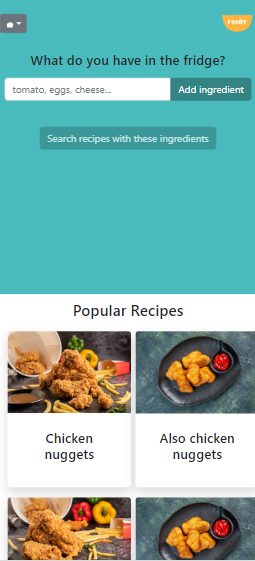
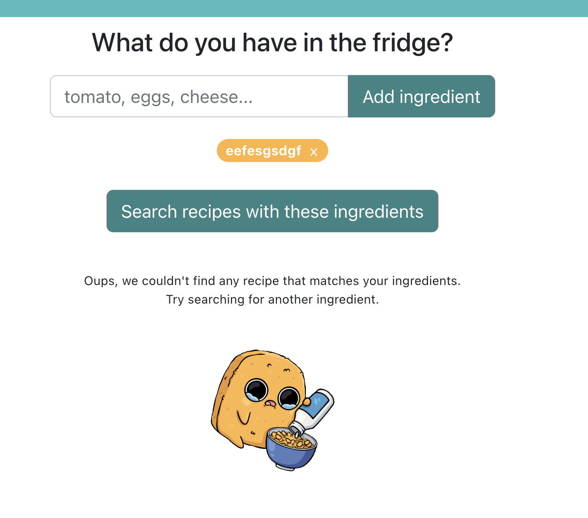
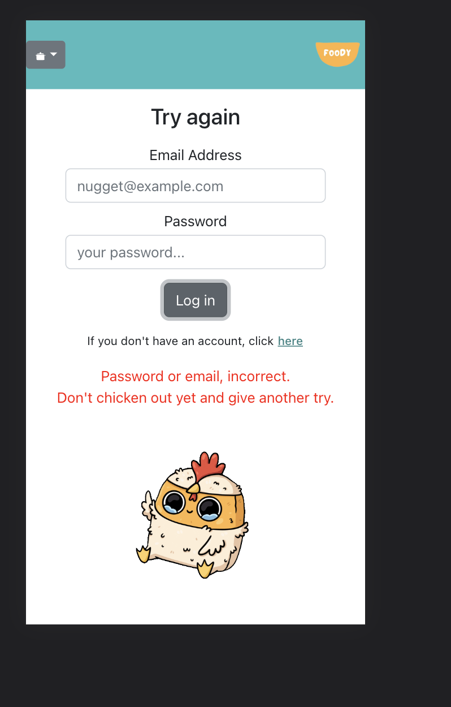

## FOODY app (Spoonacular API)

Made by foodies for foodies.

Foody app is a collaborative project.
Our app helps avoid food waste & save time by making the most of what you have at home. It's a recipe app that helps users search for recipes based on the ingredients they already have in their fridge.

### Run the project

To run this project you will need to set some environment variables.

1. Create a new file called .env inside the client folder.
2. Create a new env file in main folder (FS23-Team1).
3. Run npm install on both main folder (FS23-Team1) and inside client.
4. Run npm run migrate on the back end to get Data base.

### API

Using the spoonacular API for recipes. It allows search by ingredient and show recipes.

1. Create a Spoonacular account
2. Login to your Spoonacular account
3. All documentation is here https://spoonacular.com/food-api/docs

### Main features

User authentication
Private route
Register/login
The user is able to add recipe to favourites
Search by ingredient
Show ingredients in blocks
Show details about the recipe
Show nutrition
Compare health score
Website being responsive

### User Journey

A user can see a home page, search for an recipe & get results
A user can create a profile
A user can log in to their profile
A User can click on result page to see more details about the recipe
User can add recipe to favourite list
User can delete recipe from list of favourites
User can compare health score

## Technologies

- VS Code  
- HTML5
- ES6 JavaScript  
- React  
- Git/Github
- React js
- MySql
- Node js
- Bootstrap
- bcrypt

## Backend tables

Db name= recipes
Db tables= users, favorites

## Website overview & error handling

